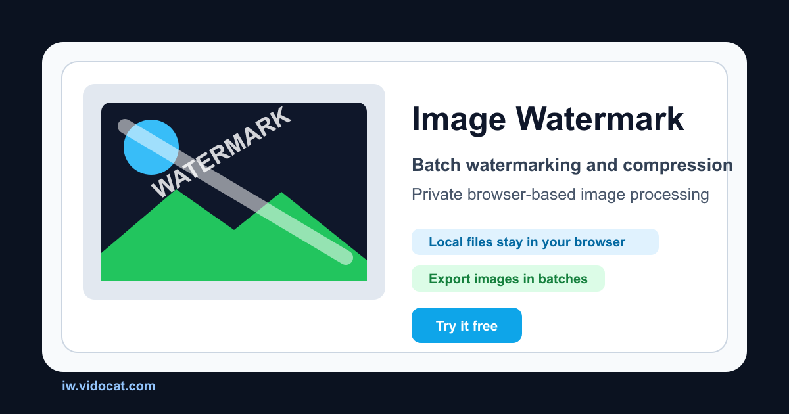

# Image Watermark

Browser-based image tools for batch watermarking, image compression, and EXIF / metadata editing. Files are processed locally in the browser and are not uploaded to a server.

[Live demo](https://iw.vidocat.com/) · [Chinese README](README_CN.md) · [Roadmap](ROADMAP.md) · [Report an issue](https://github.com/xyh9949/image-watermark/issues)




## Why This Project

Most quick image tools require uploads, accounts, or server-side processing. Image Watermark is designed for privacy-sensitive workflows where the browser should do the work:

- No image upload for watermarking, compression, or metadata editing.
- No account, database, or server-side file storage.
- Batch workflows for repeated publishing tasks.
- Chinese and English routes for both users and search engines.
- SEO / GEO support with sitemap, canonical links, hreflang, FAQ content, and `llms.txt`.

## Tools

### Batch Watermark Tool

- Add text watermarks, image watermarks, or full-screen tiled watermarks.
- Use nine-position presets or custom placement.
- Tune opacity, rotation, size, stroke, shadow, and color.
- Preview the result before exporting.
- Process multiple images and download the final files.

### Batch Compression Tool

- Compress JPEG, PNG, WebP, and GIF files in the browser.
- Choose high, balanced, or high-compression quality presets.
- Remove image metadata when needed.
- See original size, compressed size, saved space, and compression ratio.
- Download individual files or a ZIP archive.

### EXIF / Metadata Tool

- View metadata from JPG, JPEG, PNG, and WebP files.
- Edit common fields such as title, description, keywords, author, copyright, camera, lens, date, comments, and GPS.
- Browse advanced EXIF, IPTC, XMP, ICC, PNG, WebP, File, System, and Composite tags.
- Clear all metadata, GPS metadata, or selected fields.
- Batch clear metadata and download results as ZIP.

## Good Fit For

- Photographers who need to remove GPS data before publishing.
- Ecommerce teams preparing product images in batches.
- Bloggers and creators adding repeatable brand watermarks.
- Designers protecting draft assets before sharing.
- Developers who want a local-first image utility built with Next.js.

## Tech Stack

| Area | Technology |
| --- | --- |
| Framework | Next.js 16, React 19 |
| Language | TypeScript |
| Styling | Tailwind CSS 4 |
| Canvas | Fabric.js |
| Metadata engine | ExifTool via `@uswriting/exiftool` WASM |
| ZIP export | `fflate` |
| UI primitives | Radix UI |

## Getting Started

### Requirements

- Node.js 20.9+ recommended. Node.js 22 is used for Docker.
- npm 10+ recommended.

### Local Development

```bash
git clone https://github.com/xyh9949/image-watermark.git
cd image-watermark
npm install
npm run dev
```

Open [http://localhost:3000](http://localhost:3000).

### Quality Check

```bash
npm run verify
```

`verify` runs type checking, linting, production build, and HTML smoke checks for the localized routes.

### Production Build

```bash
npm run build
npm run start
```

### Docker

```bash
docker build -t image-watermark .
docker run -p 3000:3000 image-watermark
```

## Routes

| Route | Description |
| --- | --- |
| `/` | Chinese watermark tool |
| `/compress` | Chinese compression tool |
| `/metadata` | Chinese EXIF / metadata tool |
| `/en` | English watermark tool |
| `/en/compress` | English compression tool |
| `/en/metadata` | English EXIF / metadata tool |
| `/sitemap.xml` | Sitemap |
| `/llms.txt` | AI-readable project summary |

## Privacy Model

Image Watermark is a local-first web app. The image file is read by the browser and processed on the user's device. The app does not require a backend upload flow, user account, or database for the core tools.

Metadata editing uses a WebAssembly build of ExifTool loaded in the browser. Output files are generated as new downloads; original files are not overwritten.

## Project Scripts

```bash
npm run dev          # Start the development server
npm run build        # Build for production
npm run start        # Start the production server
npm run lint         # Run ESLint
npm run type-check   # Run TypeScript checks
npm run smoke:html   # Check static HTML metadata and localized pages
npm run verify       # Run the full local verification suite
```

## Contributing

Issues and pull requests are welcome. Please read [CONTRIBUTING.md](CONTRIBUTING.md) before opening a PR.

Useful first contributions:

- Improve README examples or screenshots.
- Report metadata tags that fail on a specific file format.
- Add localized copy improvements.
- Improve accessibility and keyboard navigation.
- Help test large batch workflows.

## Security

Please do not open public issues for security-sensitive reports. See [SECURITY.md](SECURITY.md).

## License

MIT License. See [LICENSE](LICENSE).
