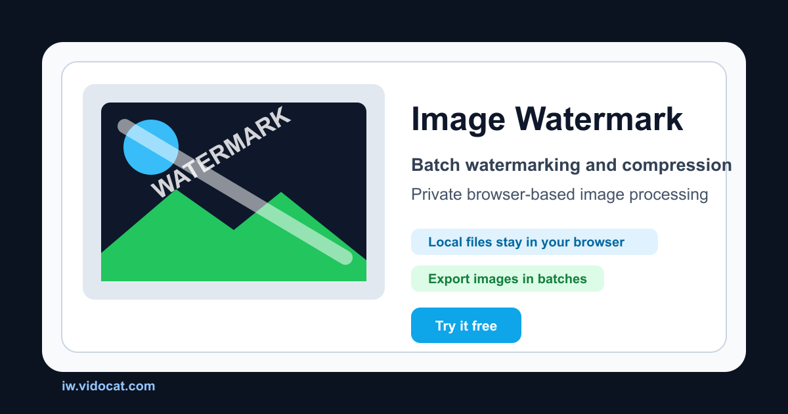

# Image Watermark 图片工具

[English](README.md) | 简体中文

一个浏览器端本地处理的图片工具，支持批量加水印、批量压缩、EXIF / 元数据查看编辑与清除。图片在用户浏览器中处理，不上传服务器。

[在线体验](https://iw.vidocat.com/) · [路线图](ROADMAP.md) · [更新日志](CHANGELOG.md) · [反馈问题](https://github.com/xyh9949/image-watermark/issues)




## 为什么做这个项目

很多在线图片工具需要上传文件、注册账号，或者把图片交给服务器处理。Image Watermark 更适合隐私敏感和高频批处理场景：

- 水印、压缩、元数据编辑都在浏览器本地完成。
- 不需要账号、数据库或服务器端文件存储。
- 支持批量处理，适合重复发布流程。
- 已支持中文和英文路由。
- 已补充 SEO / GEO：sitemap、canonical、hreflang、FAQ 内容和 `llms.txt`。

## 界面与操作

- 桌面端采用文件列表、预览 / 结果、设置三栏布局，操作按钮固定在设置区底部。
- 手机端顺排显示预览和设置，点击“图片”展开文件列表，折叠时保留编辑状态。
- 中文 / 英文切换位于全局导航，切换后仍进入对应工具页。
- 常用设置直接展示，旋转、描边、位置微调、导出设置和元数据高级字段按需展开。
- 水印画布和元数据 WASM 引擎按需加载；元数据读取或写回期间锁定编辑，避免输入被覆盖。

## 功能

### 批量水印工具

- 添加文字水印、图片水印和全屏平铺水印。
- 支持九宫格位置和自定义位置。
- 可调整透明度、旋转、大小、描边、阴影和颜色。
- 导出前实时预览效果。
- 支持多图处理和下载。

### 批量压缩工具

- 在浏览器中压缩 JPEG、PNG、WebP 和 GIF。
- 支持高质量、均衡、高压缩三档质量预设。
- 可按需移除图片元数据。
- 显示原始大小、压缩后大小、节省空间和压缩率。
- 支持单文件下载和 ZIP 打包下载。

GIF 通过 Canvas 作为静态图片处理，不保留动画，输出可能为 PNG。已优化的图片再次处理后不一定变小，结果区会如实显示体积变化。

### EXIF / 元数据工具

- 查看 JPG、JPEG、PNG、WebP 图片元数据。
- 编辑标题、描述、关键词、作者、版权、相机、镜头、拍摄时间、评论和 GPS。
- 查看高级 EXIF、IPTC、XMP、ICC、PNG、WebP、File、System、Composite 标签。
- 支持清除全部元数据、清除 GPS、清除选中字段。
- 支持批量清除元数据并打包下载。

**编辑边界：** 展示 ExifTool 能识别的字段，但不保证所有信息都能修改。File、System、ExifTool、Composite 等系统或计算字段只读；其他标签受 ExifTool 和目标格式的写入能力限制，失败字段会显示错误。

**清除提醒：** 清除全部元数据也会移除方向信息和色彩配置，可能改变图片的显示效果。只需要隐藏位置时，优先使用“清除 GPS”。处理结果另存为新文件，不覆盖原图。

## 快速使用

### 添加水印

1. 打开[水印工具](https://iw.vidocat.com/)，上传一张或多张图片。
2. 选择文字、图片或全屏水印，调整内容、位置、尺寸和透明度。
3. 在预览区检查效果，使用预览工具栏导出当前图片，或点击“开始处理”批量处理并下载。

### 压缩图片

1. 打开[压缩工具](https://iw.vidocat.com/compress)，上传图片并选择质量预设。
2. 按需开启“移除元数据”，然后开始压缩。
3. 查看原始大小、输出大小和压缩率，单独下载或使用“下载全部”获取 ZIP。

### 查看、编辑与清除元数据

1. 打开[元数据工具](https://iw.vidocat.com/metadata)，上传 JPG、PNG 或 WebP，等待引擎初始化和读取完成。
2. 从文件列表选择图片，通过搜索与分组查看标签，在右侧表单或高级表格中修改可编辑字段。
3. 点击“应用修改”，检查成功提示或字段错误，再下载当前文件。也可以清除全部、GPS 或选中字段；多图勾选后可批量清除并下载 ZIP。

## 适合谁

- 摄影师：发布前清除照片 GPS 和敏感拍摄信息。
- 电商团队：批量压缩商品图，减少页面体积。
- 博主 / 自媒体：批量添加品牌水印。
- 设计师：分享草稿前添加版权标识。
- 开发者：需要一个本地优先的开源图片处理工具。

## 技术栈

| 模块 | 技术 |
| --- | --- |
| 框架 | Next.js 16、React 19 |
| 语言 | TypeScript |
| 样式 | Tailwind CSS 4 |
| 画布 | Fabric.js |
| 元数据引擎 | 通过 `@uswriting/exiftool` 在浏览器运行 ExifTool WASM |
| ZIP 导出 | `fflate` |
| UI 基础组件 | Radix UI |

## 本地运行

### 环境要求

- 本地验证需要 Node.js 22.15+。CI 和 Docker 使用 Node.js 22。
- 推荐 npm 10+。

### 开发模式

```bash
git clone https://github.com/xyh9949/image-watermark.git
cd image-watermark
npm install
npm run dev
```

打开 [http://localhost:3000](http://localhost:3000)。

### 本地验证

```bash
npm run verify
```

`verify` 会执行类型检查、零警告 lint、元数据回归测试、生产构建和 HTML smoke 检查。元数据测试使用本地 WASM 和测试图片，不上传文件。

### 生产构建

```bash
npm run build
npm run start
```

### Docker

```bash
docker build -t image-watermark .
docker run -p 3000:3000 image-watermark
```

## 路由

| 路由 | 说明 |
| --- | --- |
| `/` | 中文水印工具 |
| `/compress` | 中文压缩工具 |
| `/metadata` | 中文 EXIF / 元数据工具 |
| `/en` | 英文水印工具 |
| `/en/compress` | 英文压缩工具 |
| `/en/metadata` | 英文 EXIF / 元数据工具 |
| `/sitemap.xml` | 网站地图 |
| `/llms.txt` | 面向 AI 的项目摘要 |

## 隐私模型

Image Watermark 是本地优先的 Web 应用。图片文件由浏览器读取，并在用户设备上处理。核心工具不依赖服务器上传、用户账号或数据库。

元数据编辑通过浏览器端 WebAssembly 版本 ExifTool 完成。处理结果会生成新文件下载，不覆盖原始文件。

## 常用命令

```bash
npm run dev          # 启动开发服务器
npm run build        # 生产构建
npm run start        # 启动生产服务
npm run lint         # ESLint 检查
npm run type-check   # TypeScript 检查
npm run test:metadata # 使用本地 WASM 运行元数据回归测试
npm run smoke:html   # HTML 和 SEO smoke 检查
npm run verify       # 完整验证
```

## 参与贡献

欢迎提交 Issue 和 Pull Request。提交 PR 前请阅读 [CONTRIBUTING.md](CONTRIBUTING.md)。

适合优先参与的方向：

- 补充 README 示例或截图。
- 反馈特定格式下无法写入的元数据标签。
- 优化中英文文案。
- 改善无障碍和键盘操作。
- 测试大批量图片处理流程。

## 安全问题

安全相关问题请不要直接公开发 Issue，详见 [SECURITY.md](SECURITY.md)。

## 开源许可

本项目采用 MIT 许可证，详见 [LICENSE](LICENSE)。
